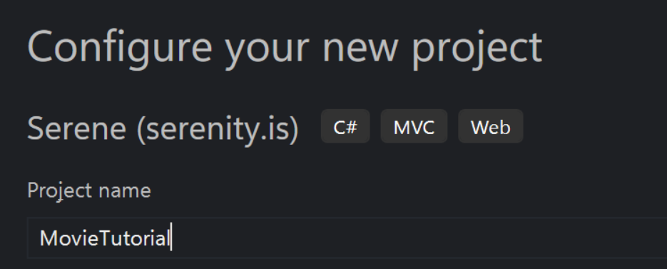

# 💡 Tạo dự án ban đầu với Serene.


**Lưu ý:** Tổng quan video ngắn gọn là cách tuyệt vời để giới thiệu công nghệ đến mọi người. Nhúng video YouTube để hướng dẫn sử dụng.


## Video tổng quan

Bạn có thời gian không? Hãy xem video tổng quan về hướng dẫn:



### Trong hộp thoại "Create a New Project", nhập "Serene" vào ô tìm kiếm:

<figure><figcaption></figcaption></figure>

<figure><figcaption></figcaption></figure>

### Trong hộp thoại "Configure your new project", nhập "YourProject" làm tên dự án và nhấp vào nút "Tiếp theo" một lần nữa.

<figure><figcaption></figcaption></figure>

### Sau khi hoàn tất, thì sẽ xuất hiện như vậy

<figure><figcaption></figcaption></figure>
